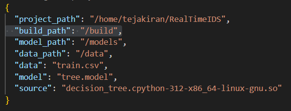

# **📌Real Time IDS**

Real Time IDS is an Intrusion Detection System designed to analyze network flow in real time and identify potential threats. By leveraging a machine learning-based detection layer, it provides accurate insights into network activity, allowing users to make informed security decisions. This system enhances network protection by detecting anomalies and giving users control over the next steps.

## **✨Highlights**
- Detects different threats like **DoS, Portscan, and Bot** from network packets.
- Simulates a **real-time IDS** using **pcap files** that may contain malicious packets.
- The entire **machine learning layer** is built from scratch using **C++ and CUDA** for high-performance detection.
- Utilizes **PyFlowmeter** to convert raw packets into flows and extract key network features.
- Provides detailed **IP address and host information** for potential threats.

## **🔧Installation**

### **📋Prerequisites**
Ensure you have the following installed on your system:
- **Python 3**
- **G++** (GNU Compiler Collection)
- **CUDA Toolkit** (for GPU acceleration) – Install it using:
  ```bash
  sudo apt install nvidia-cuda-toolkit
  ```

### **⚙️Setting Up the Environment**
- **Requirements** :
  This `scripts/requirements.txt` file contains all the necessary Python dependencies for the project. Place any additional required dependencies here.
- **Virtual Environment:** : 
  ```bash
  source {path to dependencies.sh}
  ```

  Execute the command, and voila! It will automatically create the virtual environment (if it doesn't already exist) and install all the required dependencies for you. You can run the script from any directory. Easy Peasy!

### **🛠️Compiling Machine Learning Layer**

The `compile.sh` script is responsible for compiling the machine learning layer and generating a `.so` file, which serves as the Python binding for the C++ logic.

Execute 

 ```bash
  source {path to compile.sh}
  ```

The compiled `.so` file will be placed inside the `build/` directory.

### **📁Configuration**

The project relies on a configuration file located at `config/path.json` to define paths for various components like training data, model paths, and other relevant directories. The root project path is dynamically updated by the run.sh script, based on the location of the project.

This allows for seamless portability across different environments, ensuring that all the paths within the configuration file are relative to the project root.




### **▶️Running the Project**
To start the Intrusion Detection System, simply execute `run.sh` inside the `scripts/`, providing only the name of the pcap file (which should be placed in the `data/` folder):

```bash
source {path to run.sh} <pcap_filename>
```
Viola! 🚀 Your IDS is up and running! 🎯

### **📖 Documentation**

The project comes with detailed documentation covering all Python and C++ classes, functions, and modules.

To access the documentation, open the following file in your browser:

```
docs/index.html
```

Simply navigate to the `docs/` folder and open `index.html` in any web browser to explore the full documentation.

## 🎥 Demo 

Watch the project in action! Check out the demo video:
  
[](https://www.youtube.com/watch?v=WdYylw39tjM)  

Click the image or [this link](https://www.youtube.com/watch?v=WdYylw39tjM) to watch the demo.


